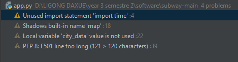
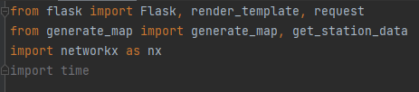
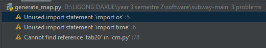
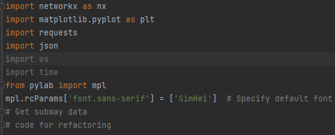
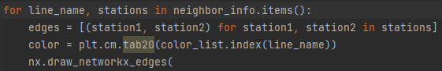
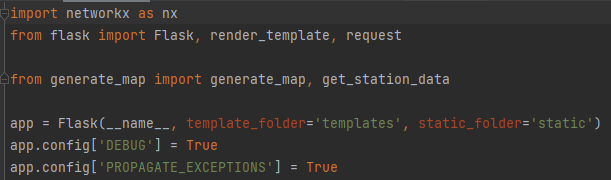
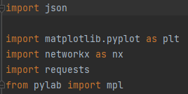
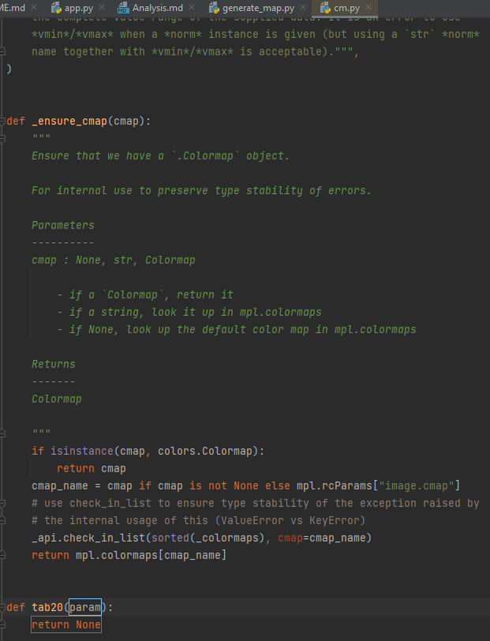

**Code Analysis**

There were 4 warnings in total and 3 weak warnings. One warning was present
in app.py and the other 3 were present in generate_map.py. The file that had the 
3 weak warnings was also app.py.

app.py  

generate_map.py  

To fix the problems above all that was needed in both app.py and generate_map.py
was to optimize the imports. All that was necessary was to remove the ones that
weren't being utilized.

app.py  
What fixed the errors in this code was getting rid of the time import which we ended
up not using, after removing it.

generate_map.py  
For this file, the solutions required import optimization and to add the required
tab20 into cm.py once that was done generate_map was optimized.

Our code from the start required little to no optimization, as most of the warnings it had
were mostly due to us changing the code overtime which ended up with those imports
becoming obsolete as they weren't used anymore in our current code.