**Subway Roaming**

**班级：07112006      第14组**

**尚荣-1820201064**

**孙博-1820201076**

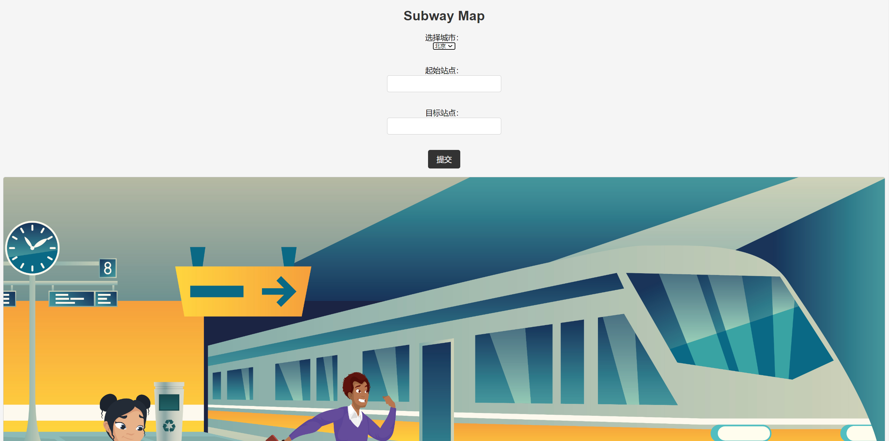

_PSP Table_

| PSP                                      | Estimated time (minutes) | Actual time taken (minutes) |
|------------------------------------------|--------------------------|-----------------------------|
| Planning                                 | 80                       | 60                          |
| --Estimate                               | 80                       | 60                          |
| Development                              | 3020                     | 2550                        |
| --Analysis                               | 140                      | 100                         |
| --Design Spec                            | 140                      | 100                         |
| --Design Review                          | 60                       | 60                          |
| --Coding Standard                        | 50                       | 50                          |
| --Design                                 | 140                      | 120                         |
| --Coding                                 | 2100                     | 1800                        |
| --Code Review                            | 70                       | 80                          |
| --Test                                   | 320                      | 240                         |
| Reporting                                | 210                      | 200                         |
| --Test Report                            | 60                       | 60                          |
| --Size Measurement                       | 40                       | 40                          |
| --Postmortem &  Process Improvement plan | 110                      | 100                         |
| Total                                    | 3310                     | 2780                        |

_Code Organization_

The module consists of two main files: generate_map.py and app.py. generate_map.py contains two funcitons those being the subway map generation and finding the shortest path.
app.py is responsible for the web application using the Flask framework, handling user requests, and integrating with the generate_map module.
The module includes additional files such as HTML templates and image files for rendering the web pages.
Classes and Functions:
generate_map.py does not defy any of the classes. What it does is that it uses a single function that being generate_map that as the name implies generates the subway map and finds the shortest path between the two stations.
The function generate_map(source, target) accepts the source and target station names as input and returns a result string.
The function is responsible for retrieving subway data, extracting station information, building the adjacency list, creating a graph, computing the shortest path, highlighting the path, drawing the graph, and saving the map to a file.
app.py defines a Flask application with routes for handling user requests, including the main page and the map generation page.
The map() route in app.py invokes the generate_map() function to generate the subway map and returns the result to the user.

_Key Algorithm_

The key algorithm in the generate_map() function uses a the NetworkX library to build a graphic representation of the subway system.
The adjacency list is constructed based on the subway data, and the shortest path is obtained by using the NetworkX shortest_path function.
The graph is then visualized using the Matplotlib library, with the shortest path highlighted.
The resulting map is saved as an image file.
Unique Aspects:
The unique aspect of the algorithm is its combination of graph theory and data visualization techniques to generate and display the subway map.
The integration of external libraries such as NetworkX and Matplotlib allows for efficient graph manipulation and visualization.
The use of web technologies, specifically the Flask framework, enables the creation of a user-friendly web interface for accessing the subway map and shortest path functionality.

Another thing to note is how the program is able to work in realtime because of the map API we have that is provided by 搞得地图, so any realtime changes are supported because of if the providers update anything it is reflected on our program. This is also how we are able make it so the program supports different cities. However it is also important to mention that the subway maps are based on geographic coordinates so the maps don't resemble the svg maps. We decided to opt for this approach as it reduced complexity. 

_Error and Exception handling_

The program handles exceptions like invalid inputs and missing paths, should an user input a wrong station name then an error message will appear stating such error. As for error handling the get_map() function has conditions implemented to make sure that no invalid data is entered.  

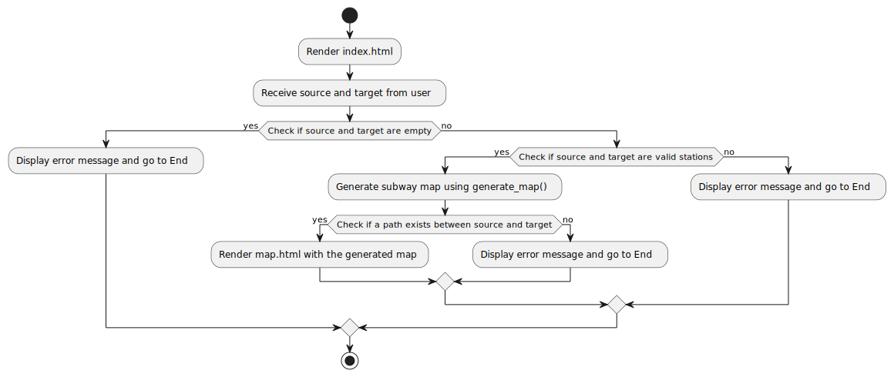

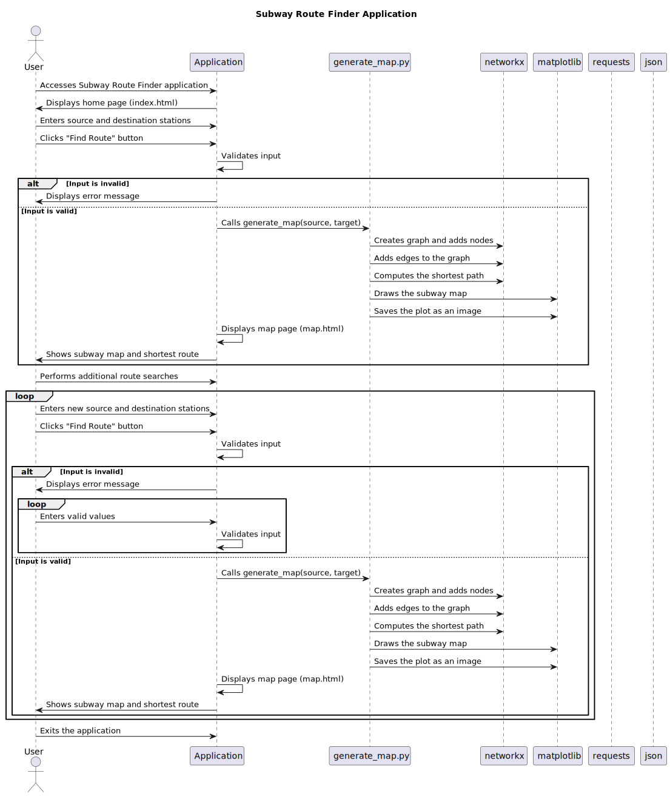

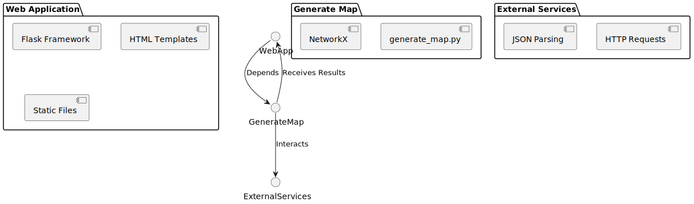

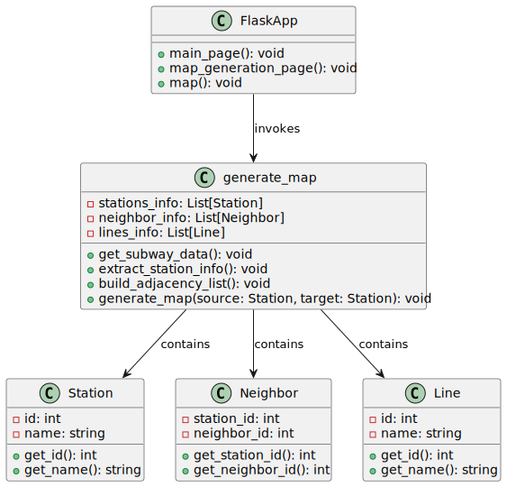

_Design by Contract and Code Contract_

Even if they proved to be fine additiions to software development we decided not to implement either of them to our development process as we just found working normally better. Not to mention that Code Contract functions with .NET projects which ours isn't so it wasn't really aplicable to it. As for Design by Contract even 

_User Interface_

The user interface should allow users to input the source and target stations for finding the shortest path between them. It should display the generated subway map highlighting the shortest path and provide a result indicating the stations along the path.
The web application can have multiple pages/templates, including the main page, map generation page, and error page. The main page should contain input fields for the source and target stations and a submit button. The map generation page should display the generated subway map with the highlighted shortest path. The error page should display error messages in case of invalid inputs or other exceptions.
The web page design works due to the implementation we used using HTML, CSS, and possibly JavaScript. The main page should have a form with input fields for source and target stations, styled with appropriate CSS. The map generation page should display the subway map using the generated image file. The error page should have a clear error message and a link to return to the main page.
In the Flask application (app.py), both the routes and the request handling functions are defined. The main route should render the main page template. The map route should handle the form submission, validate the input, and call the generate_map function from the generate_map.py module. 
We imported the necessary funcitons and data structures from the generate_map.py into the app.py module. The generate_map function is used to generate the map and obtain the shortest path result based on user input.

We are able to select from 3 cities which are 北京，天津 and 深圳.

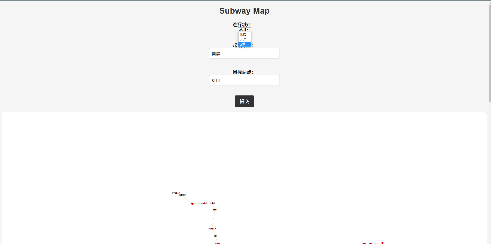

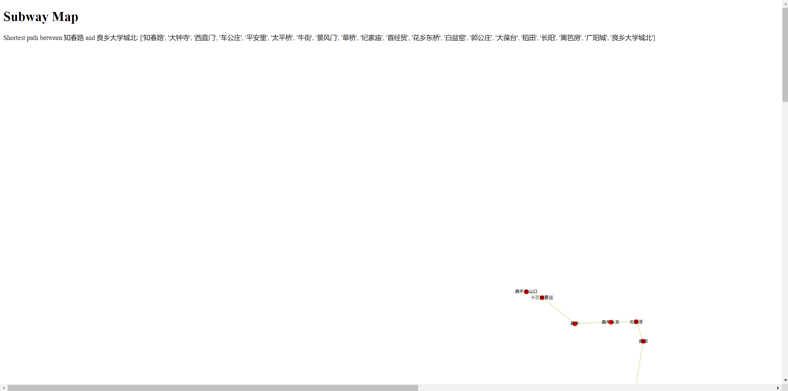

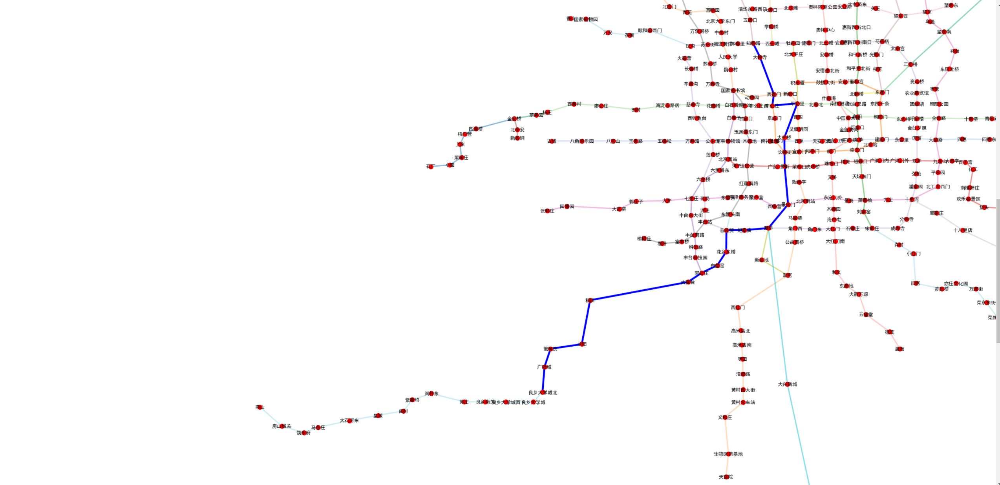

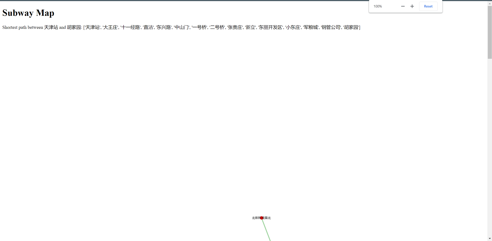

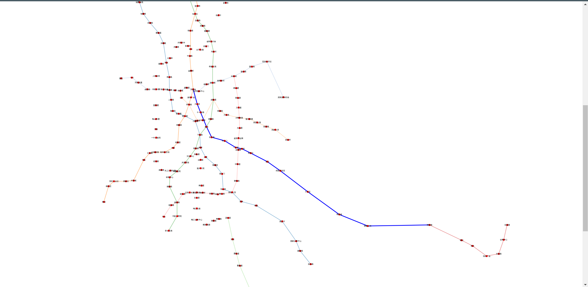

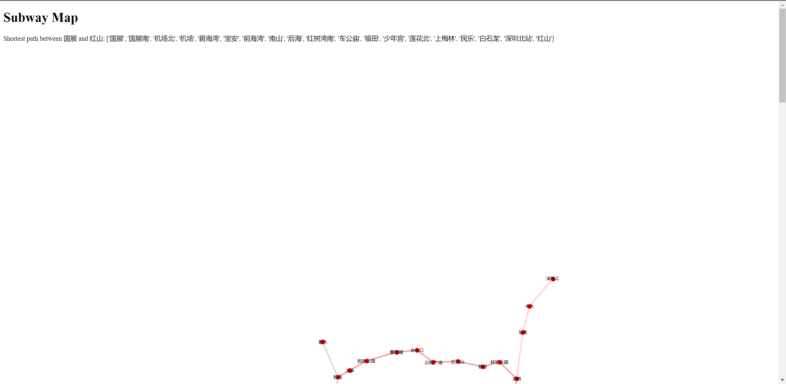

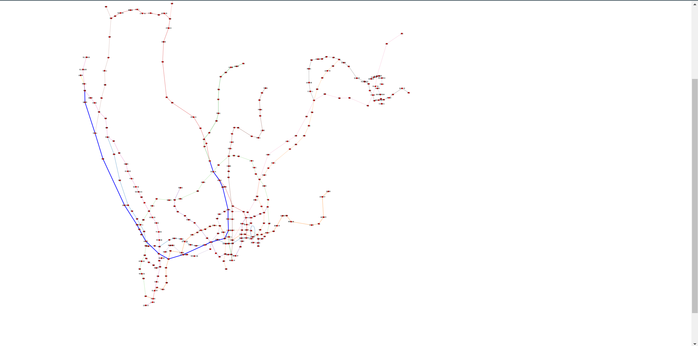

_Pairing Process_

Pair programming proved to be an interesting experience as we had a completely different idea on how it worked before, we had done group or pair work before but what we use to do was just divide the tasks and then put everything together, however we realized that the process behind pair programming is different as it is required for both programmers to work together in a single computer on the same tasks so it really is more interesting outlook on how things work, it is easier to find solutions to tasks since now there are two people thinking about them.

There is of course certain advantages and disadvantages brought with a model such as pair programmings some of these advantages can be:

(1) At the development level, pair programming can provide better design quality and code quality, and two people can have stronger problem-solving skills when cooperating.
(2) For developers themselves, pairing brings more confidence, and high-quality output brings higher satisfaction.

On the other hand one disadvantage to it can be:

(1)The pair should be equally engaged and be participative for the duration of the task. Otherwise, there would be no benefits. So if one of them is not really as inclined to talking too much or doesn't share their ideas a lot then it can lead complications while working.

A way to improve some shortcomings that the partner may have is using the sandwich method, which consists in using a praise-critique-praise so you make the critiques in between praises that way you can both open and end a conversation favorably., personally we both had a pretty smooth working time, there wasn't any issues

__Iterations__  
There were 3 iterations we had to do work for each had some requirements that had to be met. 

_Iteration 1_  
This was the first task we had on the project, we needed to make an exe that could output the station names 
and lines, since we were working with python we just used the a .py file to do the work. 
Since we were working with the 高德地图 API we already had something that provided us with the station 
names so what we needed to do was make a function that could print the subway lines into the terminal. 
Which we added as we were tasked to do. 
We also needed to mark which route is the fastest way to get to a certain place

_Encounter difficulties_

This project was a pair project, 孙博 was mainly responsible for front-end page design and 尚荣 was mainly responsible for back-end development. Due to the tight schedule during the exam week, we chose to focus on the development after the exam.

We initially planned to do this before the exam however as we kept researching and working on it we realized that we would not be able to finish before exams, therefore we decided to focus on studying and leave the project after the exams are done. So we started working on June, Sunday 25th. However both of us had some trips planned so on the weeks after the exams so it definitely affected our work as it was difficult for both of us to communicate with each other because of time differences and whatnot.  

We decided to use python as our main language for the project. It was our first time using gitlab so we were inexperienced in that regard. We had to read some information about how it worked. Thankfully the professor had uploaded some information about using its commands and explaining on how to fork it from the main project file which we did.  
