Test Case 1:  
City： 北京  
Station 1： 花园桥
Station 2： 良乡大学城北

Expected output： '花园桥', '慈寿寺', '西钓鱼台', '公主坟', '莲花桥', '六里桥', '七里庄', '丰台东大街', '丰台南路', '科怡路', '丰台科技园', '郭公庄', '大葆台', '稻田', '长阳', '篱笆房', '广阳城', '良乡大学城北

Obtained output：

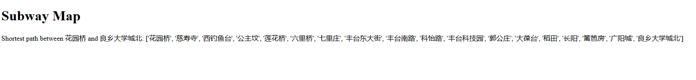
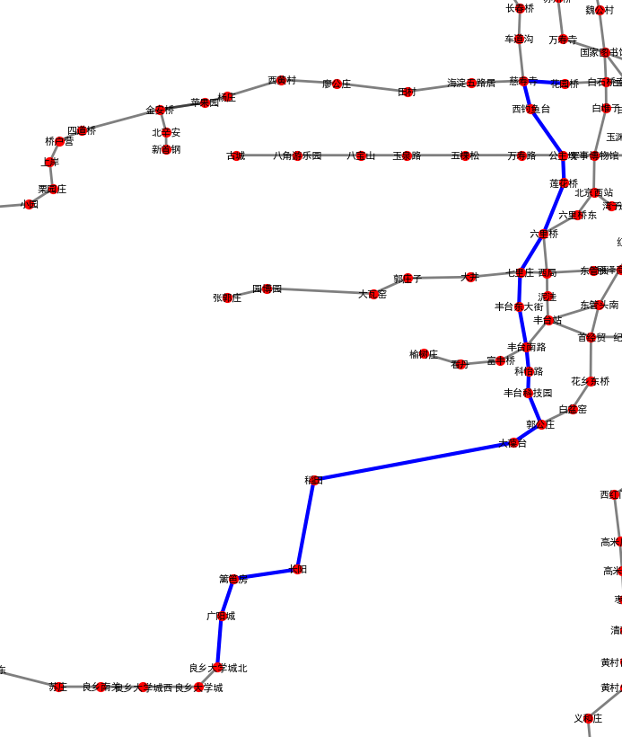

Test Case 2:
City: "北京"  
Source Station: "西单"  
Target Station: "南锣鼓巷"  
Expected Output: '西单', '灵境胡同', '西四', '平安里', '北海北', '南锣鼓巷'

Obtained output：  
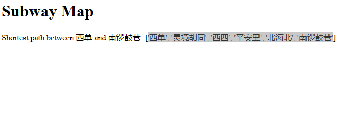
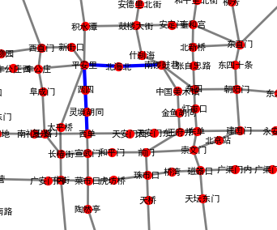

Test Case 3:
City: "深圳"  
Source Station: "大剧院"  
Target Station: "田贝"  
Expected Output: '西单', '灵境胡同', '西四', '平安里', '北海北', '南锣鼓巷'

Obtained output：  
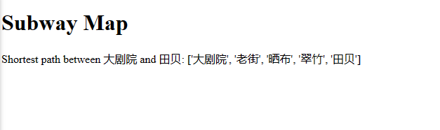
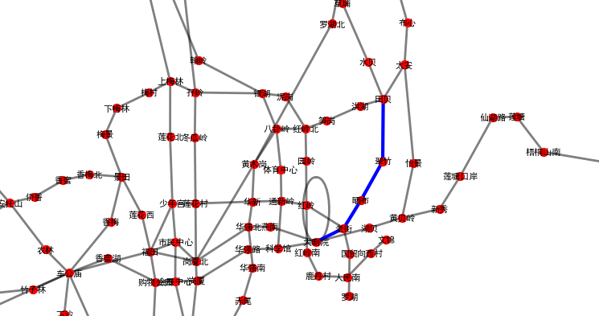

Test Case 4:
City: "天津"  
Source Station: "王顶堤"  
Target Station: "建国道"  
Expected Output: '王顶堤', '红旗南路', '周邓纪念馆', '天塔', '吴家窑', '西康路', '营口道', '和平路', '津湾广场', '天津站', '建国道'

Obtained output：  
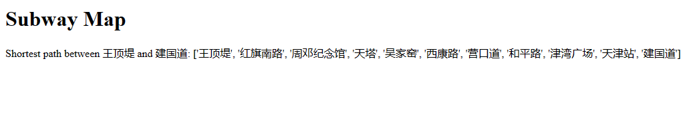

Test Case 5:
City: "深圳"  
Source Station: "爱联"  
Target Station: "香蜜"  
Expected Output: '西单', '灵境胡同', '西四', '平安里', '北海北', '南锣鼓巷'

Obtained output：  
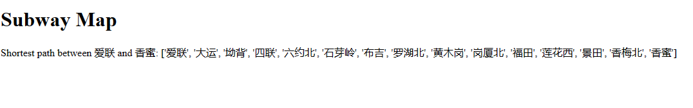
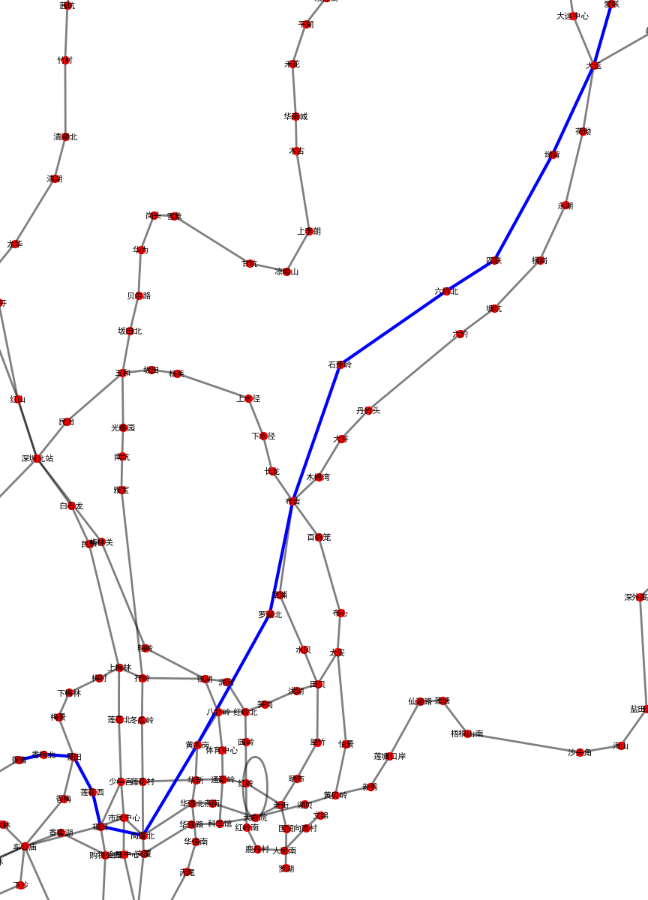

Test Case 6:
City: "北京"  
Source Station: "红旗南路"  
Target Station: "小淀"  
Expected Output: Error! please enter a valid station name

Obtained output：  
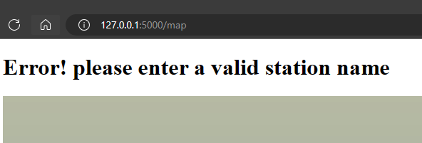

Test Case 7:
City: "天津"  
Source Station: "和平路"  
Target Station: "直沽"  
Expected Output: '和平路', '营口道', '小白楼', '下瓦房', '直沽'

Obtained output：  
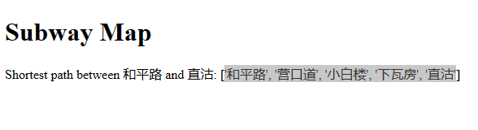
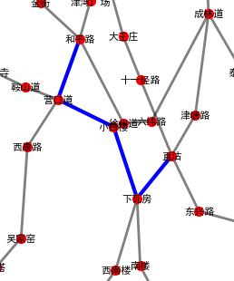

Test Case 8:
City: "深圳"  
Source Station: "湖贝"  
Target Station: "购物公园"  
Expected Output: '西单', '灵境胡同', '西四', '平安里', '北海北', '南锣鼓巷'

Obtained output：  
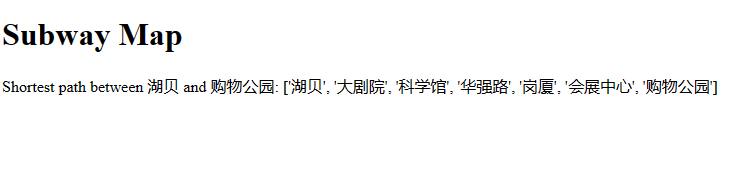
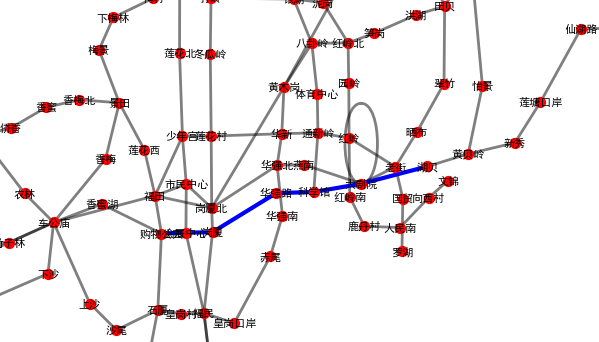

Test Case 9:
City: "天津"  
Source Station: "曹庄"  
Target Station: "会展中心"  
Expected Output: '西单', '灵境胡同', '西四', '平安里', '北海北', '南锣鼓巷'

Obtained output：  
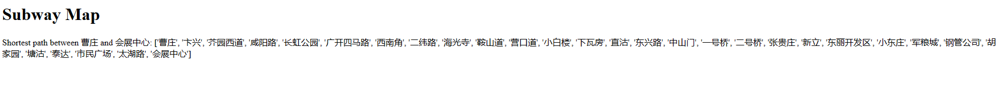
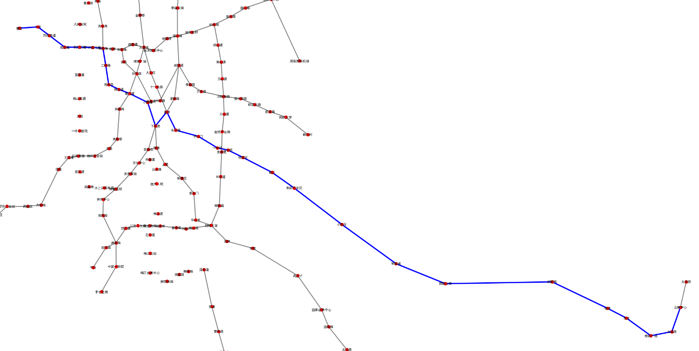

Test Case 10:
City: "深圳"  
Source Station: "深云"  
Target Station: "下沙"  
Expected Output: '西单', '灵境胡同', '西四', '平安里', '北海北', '南锣鼓巷'

Obtained output：  
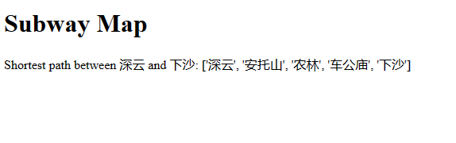
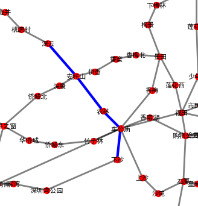

Profiling  
When we profiled our  program we noticed that it was mostly CPU focused as it can be seen when it's launched
we can see some spikes, the GPU increased a little and stayed mostly the same without any changes. 
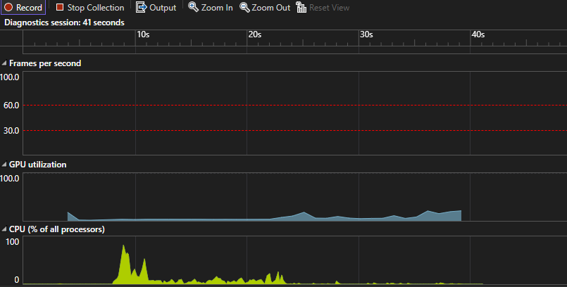  

